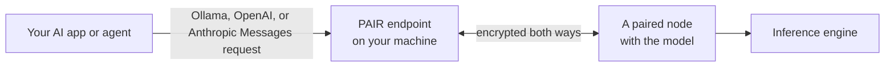

{/*
SPDX-FileCopyrightText: Copyright (c) 2026 NVIDIA CORPORATION & AFFILIATES. All rights reserved.
SPDX-License-Identifier: Apache-2.0
*/}

# NVIDIA Personal AI Router Overview

NVIDIA Personal AI Router (PAIR) turns several machines on your local network
into one place to send inference requests. You point an application at a local
address on the machine you are working at, and PAIR decides which machine
actually serves each request.

Applications do not need to know PAIR exists. The address it presents looks like
the inference engine those applications already speak to, so existing tools work
unchanged while gaining the ability to use another machine's GPU.

You install PAIR on each machine you want to contribute compute and pair those
machines together. On every one of them, PAIR runs two things:

- An **application** you interact with: a desktop window or a terminal
  interface for machines with no desktop
- A set of **background services** that do the real work

The services find the other machines on your network, keep track of which engine
and which models each one has, and decide where a request should go.

This document establishes the vocabulary the rest of the documentation uses. To
install PAIR and send a first request, go to
[Getting Started](getting-started.mdx).

## Concepts

These terms have specific meanings in PAIR:

- **Node** — one machine running PAIR. Every node runs the same software. There
  is no server, controller, or primary node.
- **Cluster** — the set of nodes you have paired together. A node belongs to at
  most one cluster, and it must leave before it can join another.
- **Engine** — the local inference server that runs models: Ollama or LM Studio.
  PAIR can install, start, stop, and update an engine, or adopt one you already
  run yourself.
- **Model** — what you prepare on each node. Nodes do not share models, so a
  node can serve a request only for a model it already holds. Preparing the same
  model on several nodes is what makes those nodes interchangeable.
- **Endpoint** — the local URL your applications use. PAIR presents one for each
  engine on the machine you are working at, and it stays the same no matter which
  node serves the request.
- **Proxy** — what sits behind an endpoint. It accepts a request, picks a node,
  forwards the request, and streams the response back.
- **Job** — one routed request, which the **Jobs** view shows. The services call
  the same thing a *workload*, which is why both words appear in logs and
  component names.
- **Broker** — the parent service on each node. It supervises the other services
  and exposes the JSON-RPC API that both the desktop application and the terminal
  interface use.

## What Happens when You Run PAIR

Running PAIR follows five steps:

1. **Start.** The application starts the broker, which starts the other
   services.
2. **Discover.** Nodes announce themselves and browse for peers on the local
   network. Discovery only finds candidates. Seeing a machine grants it nothing.
3. **Pair.** You invite a node, and someone enters the six-digit PIN on the other
   machine. Pairing is what establishes trust between two nodes.
4. **Prepare.** On each node, you enable an engine and download the models that
   node should be able to serve.
5. **Serve.** Applications send requests to the local endpoint and PAIR routes
   each one.

Discovery, pairing, and preparation are one-time work for each machine. After
you form a cluster, only the last step repeats.

## Request Model

An application sends an ordinary Ollama-compatible or OpenAI-compatible
request, or an Anthropic Messages API request, to a local proxy. The proxy
selects one eligible node and forwards the whole request. That node's engine
performs the inference, and the response streams back through the proxy.

Between machines, PAIR encrypts both the request out and the reply in, so the
whole round trip stays protected rather than the outbound half alone. Your
application sees an ordinary reply and never learns which machine served it,
though you can see that yourself.

A node is eligible when all three of these hold:

- It is reachable.
- It is running an engine that can serve the request.
- That engine's current inventory advertises the requested model.

The proxy excludes unknown and non-matching inventories. If no owner is
available, it returns a local `502`.

Among eligible owners, the proxy applies this precedence:

1. Manual selection.
2. The scheduler's priority order.
3. A deterministic default.

The scheduler ranks nodes by total pending work across both engines, and each
proxy also counts requests it has recently dispatched, so a burst of concurrent
requests spreads out instead of waiting for workload reports to catch up.

Because routing is a decision rather than a guarantee, use the **Jobs** view to
confirm where work ran.

## Trust Between Nodes

Discovery is deliberately not a trust decision. Every machine on the network is
visible. Pairing is the trust decision, and it is explicit and mutual. It
requires an invitation and a PIN that a person enters. After pairing,
node-to-node traffic runs over mutual TLS restricted to nodes in the cluster,
and the cluster refuses a machine that is not a member.

The PIN is a short convenience code for bootstrapping that exchange, not a strong
authenticator, so pair only over networks and with machines you trust. Local
applications reach the proxy over loopback.

For the trust boundaries in detail, refer to
[Architecture](architecture.mdx) and the [security policy](../SECURITY.md).

## What PAIR Provides

PAIR provides these capabilities:

- A local endpoint for compatible AI applications and development tools.
- LAN discovery plus manually configured nodes.
- Routing proxies for Ollama-compatible, OpenAI-compatible, and Anthropic
  Messages API requests.
- Pairing and cluster membership managed by the background services.
- Model-aware, workload-informed routing of independent requests.
- Encrypted routing between machines: a request sent to another node travels over
  mutual TLS restricted to the nodes you have paired, and the cluster refuses a
  machine that is not a member. Local applications reach the proxy over loopback.
- A desktop application, plus a terminal interface for headless machines, driving
  the same services.
- Visibility into nodes, engines, models, workloads, and service errors.

## What PAIR Does Not Do

PAIR has these limits:

- It does not pool GPU memory or make several GPUs act as one larger GPU.
- It does not split one model across machines or split one in-flight request.
  Each request runs whole on a single node.
- It does not move a request that is already running to a different node.
- It does not store or serve models itself. Engines fetch and hold their own.
- It does not make every client, model, engine, GPU, or network compatible.
  Behavior and performance depend on all of them.

Adding machines therefore increases how many requests you can run at once. It
does not make an individual request faster.

## How the Code Is Organized

### `desktop/`

The Electron application provides:

- A React renderer for nodes, engines, models, workloads, and settings
- A typed preload bridge
- Electron main-process lifecycle, update, and local CLI support
- A supervisor that starts `nvpair-ui-broker` and translates broker JSON-RPC into
  stable renderer contracts

The desktop build compiles its bundled Go executables from sibling `../services`.
It stages the generated binaries in `desktop/cli-bin/`.

### `services/`

The Go tree contains 12 build outputs:

- `nvpair-ui-broker`: service entry point, worker supervisor, and JSON-RPC API
- `nvpair-proxy`: the compatible inference proxy — one process hosting a facade
  for each enabled engine
- `nvpair-node-scanner` and `nvpair-node-info`: discovery and host telemetry
- `nvpair-manual-nodes`: user-specified nodes
- `nvpair-engine-manager`: local engine and model lifecycle
- `nvpair-cluster-manager`: identity, pairing, trust, and membership
- `nvpair-node-settings`: persisted settings
- `nvpair-workload-manager`: workload event replication
- `nvpair-errors`: service error registry and peer synchronization
- `nvpair-job-scheduler`: node-wide pending-work priority snapshots
- `nvpair-tui`: standalone terminal interface for headless systems

The broker supervises the worker processes. `nvpair-tui` is different. It is a
client that starts its own broker, which then starts the workers.

## Next Steps

Continue with one of these guides:

- [Install and set up PAIR](getting-started.mdx)
- [Troubleshoot common setup issues](troubleshooting.mdx)
- [Build and run PAIR](building.mdx)
- [Understand the architecture and trust boundaries](architecture.mdx)
- [Read the broker API](../services/nvpair-ui-broker/README.md)
- [Contribute](../CONTRIBUTING.md)
- [Report a vulnerability](../SECURITY.md)
